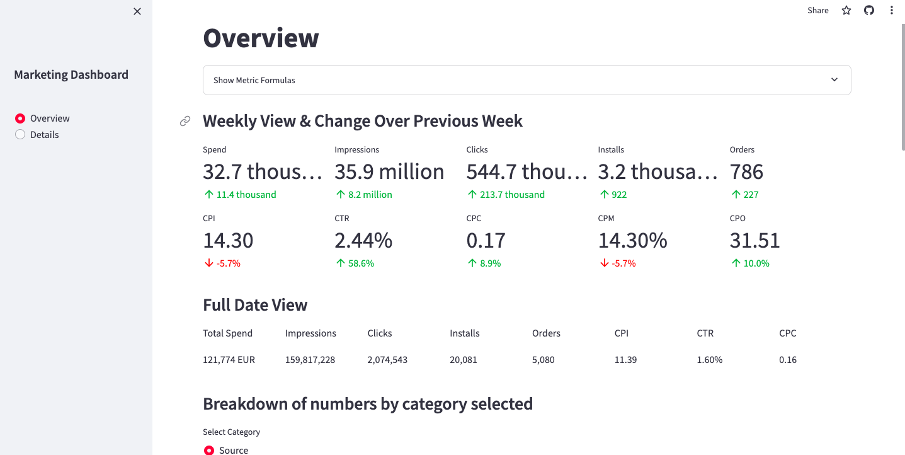
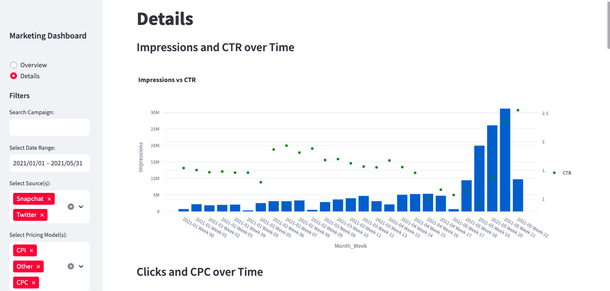

# Campaign Analytics Dashboard

Link: https://mertcan79-marketing-dashboard-app-p4dcwp.streamlit.app/

## Overview
The Campaign Analytics Dashboard is a data visualization tool designed to provide insights into marketing campaign performance. It allows users to explore key metrics, track trends over time, and analyze the effectiveness of different campaigns.

## Features
Main Overview Page: 

Provides a high-level summary of total numbers and metrics, including impressions, clicks, spend, installs, and orders. Includes pie charts and bar charts for distribution of numbers per source.

Details Page: 

Offers filters for campaign name, source, pricing model, platform, and budget. Displays bar charts per week for impressions, click, spend, and installs divided by source. Also includes line charts per metric, an order analysis table, order ratio cards, and cost per conversion vs spend bar/scatter plot per week. Dataframe Display: Presents all the data in a tabular format.

## Metrics Tracked
- Impressions
- Clicks
- Spend
- Installs
- Orders
- CTR (Click-Through Rate)
- CPC (Cost Per Click)
- CPI (Cost Per Install)
- Conversion Rate
- Cost Per Conversion
- CPM (Cost Per Mille)

## Usage
Clone the repository to your local machine.
Install the necessary dependencies (e.g., Streamlit, Plotly, Pandas).
Run the Streamlit app by executing streamlit run app.py in your terminal.
Navigate to the URL provided to access the Campaign Analytics Dashboard.